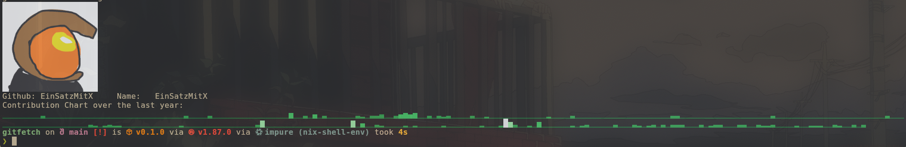
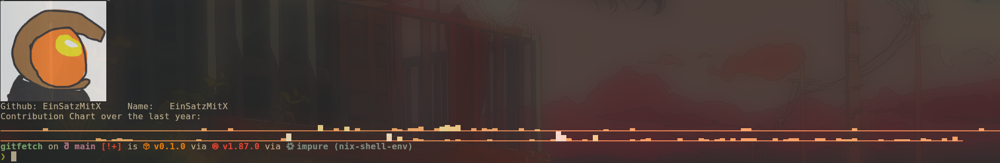

# gitfetch

A [neofetch](https://github.com/dylanaraps/neofetch) inspired tool for fetching
github profiles in the terminal

## Note

It is recommended to pass in a github token via the `--token MY_TOKEN` argument.
You can use gitfetch without it, however you may be rate limited, due to the
fact of github only accepting 60 requests per **Hour**.

## Building

```Rust
fn main(){
    todo!()
}
```

## Usage

To use gitfetch without a token (keep in mind, a username is required to be
passed via the `-u` or `--user` flag) `gitfetch -- -u EinSatzMitX`

If you want to make sure not to get rate limited, pass in a token like this

```
gitfetch -- -t MY_TOKEN -u EinSatzMitX

gitfetch -- --token "$(cat path_to_token.txt)" -u EinSatzMitX
```

You can even customize gitfetch (More customization options coming soon!) by
writing to `~/.config/gitfetch/config.json`

```Json
  "color_levels": [
    [237, 148, 85],
    [255, 187, 112],
    [255, 236, 158],
    [255, 251, 218],
    [255, 255, 240]
  ],
  "username_color": [255, 215, 0]
}
```

_Example for a very basic change of colors_

## Examples





_Example for a very basic change of colors_

## TODO

- [ ] Add customisability (what a hard word to pronounce)
